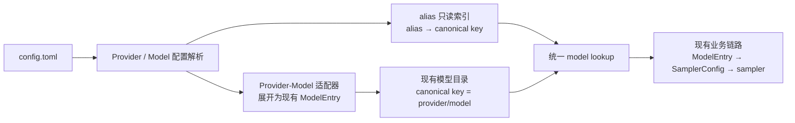
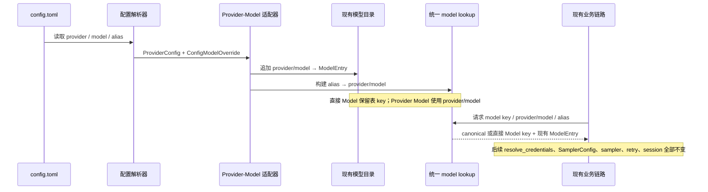

# Provider、Model 与 alias 配置读取架构设计

## 范围声明

本期只新增以下能力：

1. 在现有配置文件中定义和读取 Provider、Model、alias。
2. 将 Provider 与 Model 配置展开为现有 `ModelEntry`。
3. 在现有“按 model 标识查找模型”的入口支持 alias 和 `provider/model`，最终仍返回现有 `ModelEntry`。

本期不修改任何模型调用业务逻辑。`ModelEntry` 解析完成后的现有链路保持不变，包括凭据解析、`SamplerConfig` 生成、协议请求、流解析、retry、session/current model、工具调用、模型列表同步、自动路由、failover、诊断审计和持久化行为。

该范围是对 `research/feasibility.md` 的阶段性收窄：调研中关于模型列表同步和跨模型 failover 的结论保留为未来独立需求，不进入本架构，也不得据此拆分本期里程碑。

## 模块依赖图



边界固定在 `Lookup`：允许调整配置解析、目录构建和 model 标识查找；`Lookup` 返回 `ModelEntry` 后的全部代码和行为不属于本期。

## 模块职责

### Provider / Model 配置解析

职责：

- 从原始 TOML 读取 `[provider.<id>]` 和 `[model.<id>]`。
- 在现有 `ConfigModelOverride` 基础上新增 `provider` 与 `alias` 字段；不声明 `provider` 的直接 Model 仍是合法配置。
- 对 Provider、显式引用 Provider 的 Model 及直接 Model，统一将 `api_key` 解析为“明文”或“环境变量引用”二选一的联合类型。
- 所有 Model 均不再接受独立 `env_key`；出现该字段时跳过对应 Model 并输出不含字段值的 warning。
- 对新字段做结构校验，输出解析结果和 warning。

非职责：

- 不拉取远程模型列表，不做健康检查或能力探测。
- 不新增 reload、generation、回滚或持久化机制。
- 不修改现有凭据、认证、endpoint、header 或协议运行时策略。

### Provider-Model 适配器

职责：

- 只对显式声明 `provider` 的新 Model 配置执行 Provider 字段继承。
- 生成 catalog key 为 `provider/model` 的现有 `ModelEntry`。
- 保证 `ModelEntry.info.model` 保存上游真实 wire model ID，不把 alias 或 `provider/model` 发送给上游。
- 将 Provider 的连接字段和 Model 覆盖字段按现有 `ModelEntry` 字段形状展开，供既有链路直接消费。

非职责：

- 不新增 `ResolvedModel`、`RoutePlan` 或其他请求执行类型。
- 不修改 `resolve_credentials`、`sampling_config_for_model` 或 `SamplerConfig` 接口。
- 不引用 Provider 的直接 Model 保留其表 key 和 wire model ID，不强制转换为 `provider/model`。

### alias 只读索引与统一 model lookup

职责：

- 从有效的新 Model 配置构建 `alias → provider/model` 只读索引；索引不单独持久化。
- 统一现有按 model 标识查找的入口，使其按“alias → 精确 catalog key → 现有 wire model slug 兼容查找”的顺序解析。
- 返回 canonical catalog key 和现有 `ModelEntry`，调用方继续执行原有业务流程。

非职责：

- 不改变会话当前模型的保存语义；使用 alias 成功后，交给现有逻辑的标识必须是解析后的 canonical key，而不是 alias。
- 不实现模型选择策略、自动路由或故障切换。
- 不为 alias 增加动态改绑、版本、热更新或远程来源。

## 配置契约

### TOML 结构

```toml
[provider.openai]
base_url = "https://api.openai.com/v1"
api_key = { env = "OPENAI_API_KEY" }
api_backend = "chat_completions"

[model."openai/gpt-4.1"]
provider = "openai"
model = "gpt-4.1"
alias = "fast"

[model."my-openai"]
model = "gpt-4"
base_url = "https://example.com/v1"
api_key = { env = "MY_OPENAI_API_KEY" }
```

`api_key` 是唯一的凭据配置字段，支持两种互斥形态：

```toml
# 明文
api_key = "sk-..."

# 环境变量引用
api_key = { env = "OPENAI_API_KEY" }
```

字符串永远表示明文；inline table 永远表示环境变量引用，不根据字符串内容猜测来源。内部逻辑类型为 `ApiKeySource = Literal(String) | Environment { env: String }`。

`ProviderConfig` 只承载能直接映射到现有 `ModelEntry` 的共享字段：`base_url`、`api_base_url`、`api_key: Option<ApiKeySource>`、`api_backend`、`auth_scheme`、`extra_headers` 及现有模型连接配置已支持的同类字段。不为 Provider 新增请求期行为。

新 Model 配置继续使用 `[model.<id>]`，新增：

- `provider: Option<String>`：引用 `[provider.<id>]`。
- `alias: Option<String>`：该模型唯一的业务别名。
- `model: Option<String>`：上游 wire model ID；Provider 模型必须显式提供，或从表 key 的 `provider/` 前缀后半段无歧义取得。
- `api_key: Option<ApiKeySource>`：可选地覆盖 Provider 凭据，仍只能在明文和环境变量引用中二选一。

所有 Model 都不接受 `env_key`；环境变量引用必须写在 `api_key = { env = "..." }` 中。不声明 `provider` 的 `[model.<id>]` 是直接 Model：继续以表 key 作为 catalog key，并从自身字段构造 `ModelEntry`，不强制转换为 `provider/model`。

### 标识规则

- Provider ID 和 alias 必须是非空 ASCII 标识，允许字符为字母、数字、`.`、`_`、`-`；区分大小写，不做静默大小写归一化。
- 环境变量名必须匹配 `[A-Za-z_][A-Za-z0-9_]*`，不 trim、不改写大小写。
- Provider 模型的表 key 必须严格为 `<provider-id>/<wire-model-id>`；以第一个 `/` 分隔，Provider ID 不允许包含 `/`，wire model ID 可以包含后续 `/`。
- Provider 模型的 canonical key 就是配置表 key `provider/model`；直接 Model 的 catalog key 就是其 `[model.<id>]` 表 key。两者均不额外编码或改写 wire model ID。
- alias 不允许包含 `/`，避免与 canonical key 混淆。
- alias 在全部 Provider Model 中全局唯一；唯一性按原始、区分大小写的字符串判断，不 trim、不做大小写折叠或 Unicode 归一化。
- alias 可以与 canonical key、直接 Model catalog key 或现有 wire model slug 重名；发生重名时 alias 有意覆盖其他标识并优先解析。由于 alias 不允许 `/`，它不能覆盖合法的 canonical `provider/model`。
- 两个或更多 Model 声明同一 alias 时，该 alias 的全部声明均无效；不采用 first-wins 或 last-wins，各 Model 仍可通过 canonical key 使用。

### 字段继承

对显式声明 `provider` 的模型，Model 中显式字段覆盖 Provider 同名字段；未设置字段继承 Provider；两者均未设置时继续使用现有 `ModelEntry` 默认值。集合字段沿用现有覆盖语义，不在本期新增“显式清空”能力。

凭据处理限定在配置适配层：

- `Literal(value)` 展开为 `ModelEntry.api_key = Some(value)`、`ModelEntry.env_key = None`。
- `Environment { env }` 展开为 `ModelEntry.api_key = None`、`ModelEntry.env_key = Some(env)`。
- Model 显式 `api_key` 完整覆盖 Provider 的 `api_key`；覆盖时必须清空另一种内部凭据字段，不能同时保留继承的 literal 与 env-ref。
- 环境变量不在配置解析阶段读取，继续由现有 `resolve_credentials` 在使用模型时读取，从而保持现有密钥轮换和缺失变量处理行为。
- 直接 Model 使用同一 `ApiKeySource` 展开规则；适配完成后不修改公共 `resolve_credentials`，inline-table 环境变量引用仍只映射到内部 `ModelEntry.env_key`。

## 接口契约

### 解析 Provider 配置

```text
parse_provider_configs(raw_toml: &toml::Value)
  -> ParsedProviderConfigs
```

`ParsedProviderConfigs` 包含 `IndexMap<ProviderId, ProviderConfig>` 和 `Vec<ProviderConfigWarning>`。

错误语义：非 table Provider、非法 ID、字段类型错误或未知字段均产生 warning，并跳过对应 Provider 或字段；不得使无关的直接 Model 失效。`api_key` inline table 只允许且必须包含一个非空字符串字段 `env`；空白明文、空环境变量名、类型错误、未知成员或多余成员使该 Provider 无效。warning 只包含字段路径和错误类别，不包含明文 key、环境变量值或原始 TOML 片段。

### 展开 Provider Model

```text
expand_provider_models(
  providers: &IndexMap<ProviderId, ProviderConfig>,
  models: &IndexMap<String, ConfigModelOverride>,
  existing: &IndexMap<String, ModelEntry>,
  endpoints: &EndpointsConfig,
) -> ProviderModelExtension
```

`ProviderModelExtension` 包含：

- `entries: IndexMap<String, ModelEntry>`，key 为 canonical `provider/model`。
- `aliases: AliasIndex`，其中 `targets: IndexMap<String, String>` 保存有效 alias 到 canonical key，`blocked: HashSet<String>` 保存重复或目标无效的已声明 alias。
- `warnings: Vec<ProviderModelWarning>`。

错误语义：Provider 不存在、表 key 与 `provider` 不一致、wire model ID 缺失、`api_key` 形态无效、出现独立 `env_key` 或 canonical key 冲突时，跳过对应 Model 并 warning。alias 分两阶段校验：先收集全部语法有效声明并禁用所有重复 alias，再仅为成功展开的 Model 建立索引，禁止悬空 alias。alias 与 catalog key/wire slug 同名允许并产生 shadow warning；已有目录项本身不被删除，只是在该字符串经 lookup 时由 alias 优先命中。

### 统一 model 标识查找

```text
resolve_model_reference<'a>(
  entries: &'a IndexMap<String, ModelEntry>,
  aliases: &AliasIndex,
  requested: &str,
) -> Option<(&'a str, &'a ModelEntry)>
```

解析顺序：

1. 先检查 alias 声明：有效 alias 转为 canonical key；若名称存在于 `blocked`，返回 unknown model，不降级到同名 key/slug。
2. 精确匹配现有 catalog key，包括 canonical `provider/model` 和直接 Model key。
3. 沿用现有 wire model slug 兼容查找。

所有现有 model 选择入口必须复用该 helper，避免 `find_model_by_id` 与 `resolve_catalog_key` 对同名 wire model 得到不同结果。成功时调用方使用返回的 canonical 或直接 Model catalog key 更新现有状态，并把返回的 `ModelEntry` 交给原业务链路；失败时沿用现有 unknown model 错误，不新增 fallback。

## 数据流



唯一新增状态是由当前配置派生的内存 alias 索引，其生命周期与现有模型目录一致，不单独保存，不参与请求执行状态。

## 失败模式与对策

| 失败模式 | 对策 |
|---|---|
| 没有任何 Provider/alias 配置 | 直接 Model 按统一 `api_key` 联合语法构建目录，并保留表 key 与 wire slug lookup。 |
| Provider ID 非法或配置不是 table | 跳过该 Provider 并 warning；不影响无关的直接 Model。 |
| Model 引用不存在的 Provider | 跳过该新 Model 并 warning；不得生成 fallback `ModelEntry` 指向默认 endpoint。 |
| canonical key 与已有 catalog key 冲突 | 已有目录项优先，跳过冲突的 Provider Model 并 warning。 |
| `api_key` inline table 形态错误或明文为空 | 对应 Provider 或 Model 无效并 warning；错误信息不包含密钥值。 |
| Model 使用独立 `env_key` | 跳过对应 Model 并 warning；不得静默丢弃凭据后回退到默认密钥，warning 不包含字段值。 |
| `api_key = { env = "NAME" }` 的变量未设置或值为空 | 仍映射为现有 `ModelEntry.env_key`，由原 `resolve_credentials` 在使用时处理并沿用既有 fallback/warning 行为。 |
| 多个 Model 声明相同 alias | 该 alias 的全部声明进入 `blocked` 并 warning；请求该名称返回 unknown model，不降级到同名 key/slug；Model 仍可通过 canonical key 使用。 |
| alias 与 catalog key 或 wire slug 同名 | 允许，产生 shadow warning；lookup 确定性地优先返回 alias 目标。 |
| alias 的目标 Model 无效 | alias 不进入有效索引；请求该已声明 alias 时返回 unknown model，不继续匹配同名 key/slug。 |
| 直接 Model 含 `env_key` 之外的未知或无效字段 | 沿用现有“跳过字段、保留模型并 warning”的行为；`env_key` 按独立失败模式跳过整个 Model。 |
| alias 被用于 model 选择 | lookup 先转为 canonical key；现有状态不得保存 alias，避免 alias 改名影响已选模型。 |

## 评审记录

### 采纳项

- 采纳边界红队结论：删除远程同步、路由、failover、retry budget、stream state、generation、诊断审计等越界模块，并在文首明确下游业务逻辑不可修改。
- 采纳契约红队结论：补充实际 TOML、`ProviderConfig`/Model 新字段、继承规则、canonical ID 与 alias 冲突域，以及稳定的配置 warning 语义。
- 采纳数据流红队结论：Provider 配置必须在目录构建阶段展开成现有 `ModelEntry`；alias 只在统一 model lookup 处映射，不能让 sampler 感知 Provider 或 alias。
- 采纳直接 Model 边界：不引用 Provider 的 `[model.*]` 仍可独立构建目录项，但凭据语法统一迁移到 `api_key` 联合类型，不继续接受 `env_key`。
- 采纳“使用 alias 后保存 canonical key”的发现，避免 alias 进入既有 session/current model 状态。
- 采纳单一凭据字段：Provider、Provider Model 与直接 Model 都只暴露 `api_key`，通过 string/inline-table 联合类型区分明文和环境变量引用，并互斥映射到现有 `ModelEntry.api_key`/`env_key`。
- 采纳 alias-first：alias 可以有意覆盖 key/slug；仅 alias 之间要求全局唯一，重复 alias 的全部声明均禁用。
- 采纳 blocked alias 集合：重复或目标无效的已声明 alias 不得退化为同名 key/slug，避免配置错误静默选中其他模型。

### 驳回项及理由

- 驳回为本期新增不可变 generation、reload 或回滚：这些会改变运行时配置生命周期，不是配置字段读取的必要条件。
- 驳回在本期处理模型列表同步、退休模型或远程快照：它们属于未来独立需求。
- 驳回新增 route/sampler 契约、错误分类和跨模型 failover：本期 lookup 的输出必须是现有 `ModelEntry`，其后的业务链路保持不变。
- 驳回继续接受直接 Model 的独立 `env_key`：所有 Model 统一使用 `api_key` 联合语法，避免保留两套凭据契约。
- 驳回在配置加载时把环境变量展开为明文：这会改变现有调用时读取与密钥轮换语义；env-ref 只映射到现有内部 `env_key`。
- 驳回环境变量缺失时新增 fail-closed 凭据逻辑：这会修改现有 `resolve_credentials` 业务语义；本期保持其既有 fallback/warning 行为。
- 驳回重复 alias 的 first-wins/last-wins：结果会依赖配置顺序；重复 alias 全部禁用。

本次按收窄范围重新执行了边界、接口、数据流和失败模式四路并行红队审查。代码知识图谱 MCP 在当前会话不可用，结构核对使用本地仓库中的现有配置与 model lookup 实现完成；未同步任何 Linear 内容。
